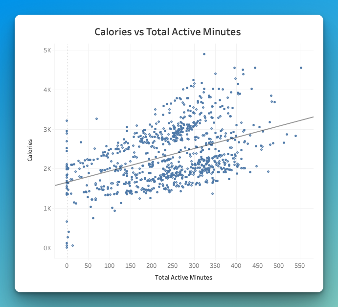
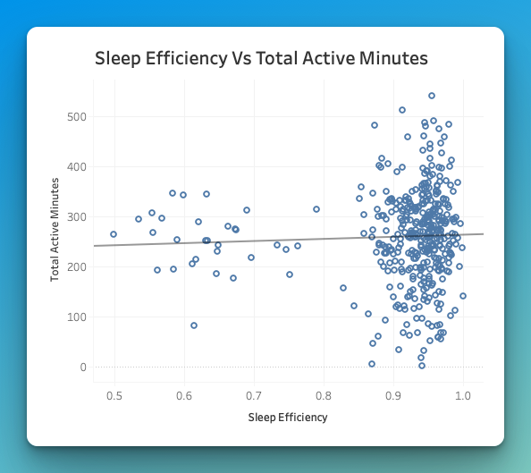
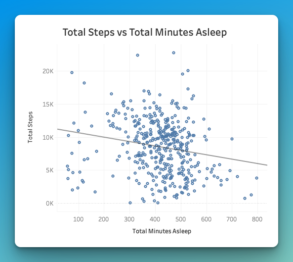

# Fitbit Usage Data Analysis

*Insights to guide Bellabeat’s product positioning and marketing strategy*

## 📌 Project Objective
- Bellabeat wants to better understand how smart device users track their activity and sleep to improve its wellness product offerings.
- This analysis uses anonymized Fitbit data as a market proxy to identify behavioral patterns and opportunities relevant to Bellabeat’s Leaf product.
- The goal is to derive insights that can inform product development, feature design, and marketing strategies.  
  
*Bellabeat’s Leaf wellness tracker - the product this analysis aims to inform*

## ❓ Guiding Questions

1. How do users engage with their smart devices daily?  
2. What patterns exist in physical activity and sleep behavior?  
3. How can Bellabeat use these insights to encourage healthier habits?

## 🧠 Executive Summary

This project analyzes one month (4/12-5/12/2016) of Fitbit usage data to uncover behavioral trends relevant to Bellabeat’s wellness products. It explores physical activity, sleep patterns, and the relationship between the two, helping identify opportunities for product design and user engagement strategies.

## 📈 Key Activity & Sleep Metrics
*These summary stats reflect Fitbit user behavior over one month.*

| Metric                    | Average Value     |
|---------------------------|-------------------|
| Avg Total Steps           | 7,638             |
| Avg Very Active Minutes   | 21 min            |
| Avg Fairly Active Minutes | 14 min            |
| Avg Lightly Active Minutes| 3 hr 13 min       |
| Avg Sleep Efficiency      | 92%               |
| Avg Time Asleep           | 6 hr 59 min       |
| Avg Time in Bed           | 7 hr 39 min       |

## 🛠 SQL Queries

PostgreSQL was used to calculate the KPIs displayed above. While these calculations could have been done in Tableau, SQL was used here to practice querying and ensure reproducibility.

[🔗 View Full SQL File](./fitbit_behavior_summary.sql)

## 🧹 Data Cleaning Overview

For full details on how the raw Fitbit datasets were prepared and transformed in Excel Power Query:  

[🔗 View Cleaning Summary](./cleaning_summary.md)

## 📊 Data Visualizations & Insights

### 1. Minutes Asleep by Weekday  
  
**Insights:**  
- Users sleep the most on **Wednesday**, with strong midweek averages overall.  
- **Monday and Friday** show the shortest sleep durations, while **Sunday** has moderate to high totals.  
- This pattern may reflect disruptions at the **start and end of the workweek**.

**Recommendations:**  
- Bellabeat could offer **sleep reminders** or **wind-down prompts** on **Sunday and Thursday nights** to encourage better sleep before the workweek starts or ends.
---
### 2. Daily Step Distribution  
  
*Each data point represents a user-day (1 user’s activity on a given day)*

**Insights:**  
- Most user-days average between **3k–12k steps**, with a steep drop-off beyond **15k**.  
- This suggests **moderate activity levels are common**, while **high-activity days are rare**.

**Recommendations:**  
- Bellabeat could promote increased movement through **progress-based goals** or **streak incentives**.
---
### 3. Calories vs. Active Minutes
  
**Insights:**  
- More active minutes per day generally lead to higher calorie burn, but the relationship is only moderately correlated. Individual variation likely plays a role.

**Recommendations:**  
- Bellabeat can improve calorie tracking by personalizing estimates using user profiles and historical data.
---
### 4. Steps by Weekday  
  
**Insights:**  
- Users average the most steps on Tuesdays and Wednesdays.  
- Weekend step counts drop, likely due to fewer routine-based activities (like commuting or gym sessions).

**Recommendations:**  
Bellabeat can nudge weekend movement using features like:  
- Weekend step goals  
- Social activity prompts  
- Mini fitness challenges  
---
### 5. Sleep Efficiency vs. Active Minutes  
  
**Insights:**  
- There’s no meaningful relationship between daily active minutes and sleep efficiency in this dataset.

**Recommendations:**  
- No action needed related to sleep efficiency. Bellabeat may focus efforts on sleep duration instead.
---
### 6. Steps vs. Minutes Asleep  
  
**Insights:**  
- There’s no strong correlation between total steps and minutes asleep.  
- Some users who sleep more are less active, while others maintain moderate steps and sleep - suggesting sleep and activity are independent for most users.

**Recommendations:**  
- Avoid linking sleep and activity in feedback or goals.  
- Provide separate, personalized targets for rest and movement to support overall balance.
---
### 7. Steps vs. Calories Burned  
  
**Insights:**  
- Positive relationship: more daily steps generally lead to more calories burned.  
- Most users fall between 3k-12k steps and 1,800-2,800 calories.

**Recommendations:**  
- Encourage step-based calorie burn goals or badges to drive motivation and reinforce the activity-calorie link in Leaf marketing.
---
## 🔍 Key Insights & Recommendations

| **Insight**      | **Recommendation**   |
|------------------|---------------|
| Users average ~7 hrs sleep but fall short on Mon & Fri   | Introduce early-week sleep nudges or Sunday evening wind-downs to extend sleep duration   |
| Most movement is light activity (~3 hrs/day) with low moderate / very active movement | Use goal streaks and progressive step challenges to boost higher-intensity engagement     |
| Peak steps midweek, lower on weekends     | Add weekend movement prompts or social challenges to maintain activity outside the work routine   |
| Strong link between steps and calories burned    | Reinforce “steps = burn” messaging in app to highlight value of even small increases in movement   |
| Sleep efficiency high (92%), but duration lacking   | Market Bellabeat as a “sleep optimizer”: high-quality rest made even better with daily usage   |
| 3K–10K steps is the most common range among users    | Design feature tiers or app rewards that align with this natural range, nudging users just past plateau  |

## 📈 Next Steps

- **Validate Findings at Scale**  
  Current insights are based on ~30 users over one month. Larger, longer-term datasets are needed to confirm trends and improve generalizability.

- **Prototype Behavior Nudges**  
  Pilot in-app features like weekday sleep prompts or step streak rewards aligned with observed patterns.

- **Explore Deeper Segmentation**  
  Future analysis could classify users by lifestyle, consistency, or goal types to tailor experiences more effectively.

## 📄 Data Source
Data from Kaggle’s [Fitbit Fitness Tracker Dataset](https://www.kaggle.com/datasets/arashnic/fitbit).  
Note: Bellabeat was not the source of this data. It was used to simulate a market analysis.